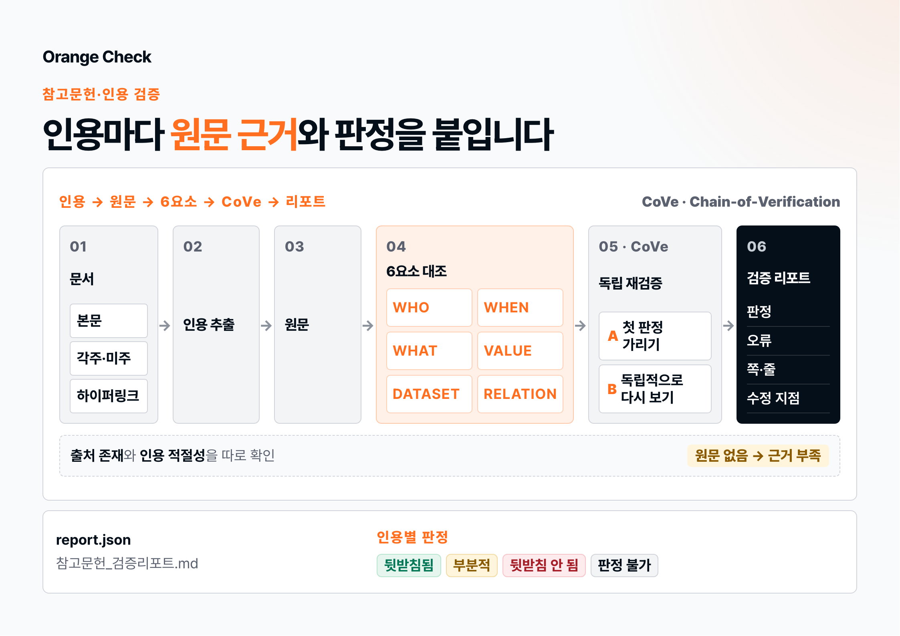

[](https://github.com/myorange-io/orange-check/releases/latest)
[](https://github.com/myorange-io/orange-check/actions/workflows/check.yml)
[](LICENSE)


# Orange Check: 참고문헌과 인용을 원문으로 검증하는 AI 스킬

> 이미 써 놓은 문서의 인용을 하나씩 열어 봅니다. 출처가 실제로 있는지, 그 출처가 본문 주장을 정말 뒷받침하는지를 원문 쪽·줄까지 짚어 판정합니다.
> Claude Code, Claude 앱(Cowork), OpenAI Codex, ChatGPT for Work에서 같은 방법으로 돌아갑니다.



읽는 형식은 `.docx` `.pdf` `.hwp` `.hwpx` `.txt` `.md`입니다. 한글 문서도 따로 설치할 것 없이 읽습니다.
본문은 물론 각주와 미주, 하이퍼링크까지 빠짐없이 훑습니다.

## 바로 시작하기

검증할 문서를 붙이고 이렇게 요청하면 됩니다.

```
이 문서 참고문헌 검증해줘. 각 인용이 출처에 맞게 인용됐는지도 봐줘.
```

| 하고 싶은 일 | 부르는 법 |
|---|---|
| 문서 전체를 검증한다 | `/orange-check` (Claude Code) · `$orange-check` (Codex) |
| 인용 목록만 뽑는다 | `/orange-check-extract` |
| 주장과 출처 한 쌍만 맞춰 본다 | `/orange-check-support` |
| 나온 검증 리포트를 채점한다 | `/orange-check-judge` |

이름을 대지 않아도 요청 내용을 보고 알아서 발동합니다. 결과로 `report.json`,
`참고문헌_검증리포트.md`, `참고문헌_검증리포트.html` 세 파일이 나옵니다.

이 프로젝트가 도움이 됐다면 ⭐를 눌러 주세요.

## 왜 Orange Check인가

서지만 훑어서는 멀쩡해 보이는 문서도, 인용을 하나씩 따져 보면 출처가 말하지 않은 데까지
넓혀 쓴 대목, 지표 이름을 슬쩍 바꾼 대목, 엉뚱한 조사에 갖다 붙인 대목이 나옵니다.
**출처가 있다고 해서 그 출처가 본문을 뒷받침하는 것은 아닙니다.** 검증할 것의 대부분이 여기 있습니다.

인용이 적절한지 느낌으로 재면 볼 때마다 답이 달라집니다. Orange Check은 판정하기 전에
**본문 주장을 여섯 칸으로 쪼개고, 칸마다 따로 출처와 맞춰 봅니다.**

| 슬롯 | 묻는 것 |
|---|---|
| WHO | 누구에 관한 수치인가 (대상 집단·범위) |
| WHEN | 언제 기준인가 |
| WHAT | 무엇을 잰 지표인가. 출처가 부르는 바로 그 이름 |
| VALUE | 수치와 단위 |
| DATASET | 어느 조사·자료에서 나왔나 |
| RELATION | 비교·인과의 방향 |

어느 칸이 어긋났느냐가 곧 오류의 종류입니다. 판정은 아래 표대로 정해집니다.

| 맞춰 본 결과 | 판정 | 오류 유형 |
|---|---|---|
| 채운 칸이 모두 일치 | 뒷받침됨 | — |
| VALUE 어긋남 | 뒷받침 안 됨 | 수치 오기 |
| WHO만 어긋남 | 부분적 | 과확장 |
| WHAT만 어긋남 | 부분적 | 지표명 오기 |
| DATASET만 어긋남 | 부분적 | 자료원 불일치 |
| WHEN만 어긋남 | 부분적 | 시점 불일치 |
| 출처가 그 지표를 아예 다루지 않음 | 뒷받침 안 됨 | 무관 |
| 출처가 없음 | 판정 불가 | 환각 |

판정을 먼저 정해 놓고 슬롯을 끼워 맞추면 이 표는 장식에 그칩니다. Orange Check은 순서가
반대입니다. 표를 먼저 채우고, 판정은 거기서 따라 나옵니다. 그래서 심판이 판정을 기계로
검산할 수 있습니다.

나머지 원칙은 이렇습니다.

- **원문을 직접 엽니다.** 제목이나 초록, 검색 결과 몇 줄만 보고 판정하지 않습니다.
- **근거는 쪽과 줄까지 짚습니다.** 몇 쪽 몇 줄에 뭐라고 적혀 있는지 원문 표현 그대로 옮깁니다.
- **없다는 사실도 증거입니다.** 출처 전문에 '한부모'가 한 번도 안 나오면, 저소득 한부모 여성에 관한 주장은 그 출처로 뒷받침되지 않습니다.
- **한 번 낸 판정은 가려 두고 백지에서 다시 봅니다.** CoVe(Chain-of-Verification)의 factored 방식입니다. 자기 답을 보면서 고치면 같은 오류를 되풀이하기 때문입니다.
- **모르면 모른다고 합니다.** 원문을 못 구했으면 근거 부족입니다. 그럴듯한 판정을 지어내는 것이야말로 이 도구가 막으려는 잘못입니다.

## 어떻게 돌아가나

**스킬 하나가 0~6단계 전체를 맡습니다.** 문서에서 인용을 빠짐없이 모으고, 출처 원문을
확보하고, 주장을 여섯 슬롯으로 쪼개 대조하고, 첫 판정을 가린 채 다시 본 뒤 리포트를 씁니다.

**단계별 하위 스킬**도 있습니다. 한 단계만 손보거나, 중간 결과를 사람이 고쳐 넣고 이어서
돌릴 수 있습니다.

| 스킬 | 하는 일 |
|---|---|
| `orange-check` | 0~6단계 전체 |
| `orange-check-extract` | 인용을 빠짐없이 모아 `citations.json`으로 정리 |
| `orange-check-support` | 주장과 출처를 맞춰 보고 적절성 판정 |
| `orange-check-judge` | 나온 검증 리포트를 채점 |

**결과 파일은 셋이지만 따로 쓰지 않습니다.** `report.json`이 기계가 읽는 정본입니다.
마크다운은 저장소에 남기는 용도이고, HTML은 문서를 쓴 사람에게 그대로 건네는 용도입니다.
마크다운과 HTML은 모두 `report.json`에서 만들어 내므로 셋이 서로 어긋날 일이 없습니다.
HTML은 파일 하나에 다 들어 있어 그냥 열면 보이고, 브라우저에서 바로 인쇄하거나 PDF로
내보낼 수 있습니다.

**플랫폼마다 되는 일이 다른 부분은 스킬이 시작할 때 스스로 확인합니다.** 셸을 쓸 수 있는지,
코드가 인터넷에 나갈 수 있는지, 독립 에이전트를 띄울 수 있는지는 조직 설정이나 샌드박스
정책에 따라 문서와 얼마든지 다를 수 있습니다. 미리 짐작해 박아 두기보다 그 자리에서
확인하는 쪽이 정확합니다.

| | Claude Code | Claude 앱 | Codex | ChatGPT for Work |
|---|---|---|---|---|
| 원문 PDF 자동 취득 | ○ | ○ | 샌드박스 설정에 따라 | ✗ 코드가 인터넷에 못 나감 |
| 독립 재검증 | 서브에이전트 | 첫 판정 가리고 다시 보기 | 첫 판정 가리고 다시 보기 | 첫 판정 가리고 다시 보기 |
| 셸 | ○ | 파이썬만 | ○ | 파이썬만 |

이 표는 스킬이 실행하면서 알아내는 내용이지 패키지에 새겨 둔 값이 아닙니다. 못 한 일은
리포트의 `run.degraded_reasons`에 남깁니다. 무엇을 못 했는지 밝히지 않은 리포트라면
무엇을 했다는 말도 믿기 어렵기 때문입니다.

ChatGPT for Work에서는 스킬이 필요한 원문을 한 번에 모아서 요청하고, 올라오지 않은
출처는 근거 부족으로 남겨 둡니다. 원문 없이 판정을 지어내지 않습니다.

## 설치

패키지는 하나입니다. 네 플랫폼이 같은 스킬을 씁니다.
[Releases](https://github.com/myorange-io/orange-check/releases/latest)에서 받으세요.

| 환경 | 받을 것 | 설치 |
|---|---|---|
| Claude 앱 (Cowork·claude.ai) | `orange-check.zip` | 스킬 업로드 |
| Claude Code | `orange-check-all.zip` | 풀어서 `~/.claude/skills/`에 복사 |
| OpenAI Codex | `orange-check-all.zip` | 풀어서 `~/.codex/skills/`에 복사 |
| ChatGPT for Work | `orange-check-all.zip` | `SKILL.md`를 프로젝트 지침에 붙여넣기 |

### Claude 앱 (Cowork · claude.ai · 데스크톱)

1. 설정 → 기능 → **코드 실행 및 파일 생성**을 켭니다. (최초 1회)
2. Cowork → 맞춤설정 → 스킬 → **＋** → **스킬 업로드**.
3. `orange-check.zip`을 고르고, 목록에 나타나면 **토글을 켭니다**.
4. 하위 스킬도 쓰려면 `orange-check-extract.zip` 등을 같은 방법으로 하나씩 올립니다.

claude.ai는 zip 하나에 스킬 하나만 들어 있어야 받아 줍니다.

### Claude Code (CLI · 데스크톱 앱)

```bash
unzip orange-check-all.zip -d /tmp/oc && mkdir -p ~/.claude/skills
cp -R /tmp/oc/orange-check* ~/.claude/skills/
```

설치하면 `/orange-check`으로 부를 수 있고, 하위 스킬은 `/orange-check-extract` 식입니다.
프로젝트 한정으로 쓰려면 `.claude/skills/` 아래에 둡니다.

### OpenAI Codex (CLI · IDE · 클라우드)

```bash
unzip orange-check-all.zip -d /tmp/oc && mkdir -p ~/.codex/skills
cp -R /tmp/oc/orange-check* ~/.codex/skills/
```

설치하면 `$orange-check`으로 부를 수 있습니다. 샌드박스가 기본으로 네트워크를 막으므로
원문 PDF를 받아야 하면 네트워크 접근을 허용하고 실행하세요. 네트워크가 막혀 있어도 동작은 합니다.
다만 원문을 직접 받는 대신 사용자에게 요청합니다.

### ChatGPT for Work (Business · Enterprise)

1. `orange-check-all.zip`을 풀고 `orange-check/SKILL.md`의 내용을 프로젝트 지침(또는 커스텀 GPT 지침)에 붙여 넣습니다.
2. `orange-check/scripts/` 폴더를 프로젝트 파일 또는 지식 파일로 올립니다.
3. 검증할 문서와 **출처 원문 PDF를 함께** 첨부합니다.

Claude Code와 Codex 모두 **폴더 이름이 곧 부르는 이름**입니다. `orange-check` 폴더를 그대로
두어야 합니다. 자세한 절차는 패키지 안 `INSTALL.md`에 있습니다.

---

## 스킬 목록

<details>
<summary><strong>orange-check</strong> — 문서 하나를 통째로 검증한다 (0~6단계 전체)</summary>

이미 완성된 문서의 참고문헌과 인용을 검증합니다. 새 글을 쓰면서 정확성을 지키게 하는
도구가 아니라, 남이(또는 AI가) 이미 써 놓은 인용이 맞는지 나중에 확인하는 도구입니다.

**하는 일**

1. 이 환경에서 무엇이 되는지 확인한다 (셸·네트워크·서브에이전트)
2. 본문·각주·미주·하이퍼링크에서 인용을 빠짐없이 모은다
3. 서지가 실제로 존재하는지 확인하고 원문을 확보한다
4. 주장을 여섯 슬롯으로 쪼개 출처와 대조한다
5. 첫 판정을 가리고 백지에서 다시 본다 (CoVe)
6. 기계 점검을 거쳐 판정을 고치고, 뒷받침되지 않는 인용에는 대체 출처를 제시한다
7. `report.json` → 마크다운 → HTML 순으로 리포트를 만든다

**요청 예시**

- `이 제안서 참고문헌 검증해줘. 각 인용이 출처에 맞게 인용됐는지도 봐줘.`
- `/orange-check 보고서.hwp`
- `$orange-check 논평.docx 원문 PDF는 sources/ 폴더에 있어`

</details>

<details>
<summary><strong>orange-check-extract</strong> — 인용을 빠짐없이 뽑아 <code>citations.json</code>으로 만든다</summary>

문서(docx·pdf·hwp·hwpx)에서 인용을 빠짐없이 뽑습니다. 본문뿐 아니라 각주·미주·하이퍼링크까지
훑어 "본문 주장 ↔ 인용 출처" 쌍으로 정리합니다. 인용 목록 뽑기, 참고문헌 정리, 각주 추출
요청에 씁니다.

**요청 예시**

- `이 문서에서 인용 목록만 뽑아줘`
- `/orange-check-extract 보고서.docx`

</details>

<details>
<summary><strong>orange-check-support</strong> — 주장과 출처 원문을 대조해 인용이 적절한지 판정한다</summary>

주장을 대상·시점·지표·수치·자료원·관계 여섯 칸으로 쪼개 칸마다 원문과 맞춰 보고, 쪽·줄과
원문 인용으로 근거를 댑니다. 이 인용이 출처에 맞는지, 과확장·지표명 오기·자료원 불일치가
있는지 볼 때 씁니다.

**요청 예시**

- `이 문장이 이 PDF 12쪽 내용으로 뒷받침되는지 봐줘`
- `/orange-check-support`

</details>

<details>
<summary><strong>orange-check-judge</strong> — 나온 검증 리포트를 채점한다</summary>

근거가 실제로 그 자리에 있는지 원문을 다시 열어 확인하고, 판정이 슬롯 표에서 규칙대로
나왔는지, 인용을 빠뜨리지 않았는지 검사한 뒤 남은 부분만 판단으로 채점합니다. 검증 리포트
채점, 검증 품질 확인, 스킬 개선 요청에 씁니다.

**요청 예시**

- `이 검증 리포트 제대로 됐는지 채점해줘`
- `/orange-check-judge report.json`

</details>

---

## 도구상자만 따로 쓰기

스킬 없이 도구상자만 써도 됩니다. 따로 설치할 것은 없고 PDF 판독기만 있으면 됩니다.

```bash
export PYTHONPATH=core/toolkit
python3 -m refver probe                                  # 이 환경에서 뭐가 되는지
python3 -m refver read 제안서.hwp --summary               # 본문·각주·미주 건수
python3 -m refver find 출처.pdf "확인할 문장"              # 쪽·줄 (쪽 경계도 넘어서 찾음)
python3 -m refver count 출처.pdf 저소득 한부모            # 안 나오면 그것도 증거
python3 -m refver validate report.json                   # 리포트 계약 검사
python3 -m refver render report.json -o 검증리포트.md      # 사람이 읽을 리포트 만들기
python3 -m refver render report.json -o 검증리포트.html    # 건네줄 HTML (파일 하나로 끝남)
python3 -m refver audit report.json --corpus sources/ --document 제안서.docx   # 정답표 없이 기계 검사
```

### 한글 문서 읽기

문서를 읽는 가장 아래층은 표준 라이브러리만 씁니다. ChatGPT 코드 인터프리터는 인터넷이 막혀 있어
`pip install`도 `npm install`도 못 하기 때문입니다.

| 형식 | 읽는 방식 | 각주·미주 |
|---|---|---|
| `.hwpx` | ZIP + OWPML XML | 정확히 갈라냄 |
| `.hwp` (5.x) | OLE2 복합문서 + 레코드 훑기 | 대략 갈라냄 |
| `.hml`, 내용이 XML인 `.hwp` | HWPML | 정확히 갈라냄 |

실제로 재 봤습니다. 손에 있던 한글 문서 1,267건 가운데 93.4%가 순수 파이썬만으로
열렸습니다. 안 열리는 나머지는 대개 HWP 3.x인데, 옛 이진 형식이라 다른 도구도 못 엽니다.

Node가 깔려 있으면 [kordoc](https://github.com/chrisryugj/kordoc)이 힘을 보탭니다. 설치 없이
`npx -y kordoc`으로 바로 쓰고, 순수 파이썬이 실패하면 알아서 넘어갑니다.

| kordoc이 더 해 주는 것 | |
|---|---|
| 표를 표로 살려 냄 | 한국 보고서는 통계가 대개 표 안에 있는데, 순수 파이썬은 문단으로 뭉갭니다 |
| 블록마다 쪽 번호 | 쪽·줄을 짚기가 수월해집니다 |
| 배포용 문서 풀기 · 망가진 CFB 복구 | 순수 파이썬으로는 손도 못 대는 파일 |
| HWPML·PDF·Office까지 한 도구로 | |

뽑아내는 글자 수는 둘이 같습니다. 실제 파일로 비교하니 한글 1,928자로 정확히 일치했습니다.
kordoc이 나은 점은 표를 구조로 살린다는 것과 열 수 있는 형식이 더 많다는 것입니다.

```bash
python3 -m refver read 문서.hwp --backend kordoc   # 표를 살려서 읽기
```

남이 준 문서를 여는 도구다 보니 XML 엔티티 폭탄, XXE, ZIP 폭탄, 경로 탈출을 먼저
막습니다(`refver/safexml.py`). `defusedxml`이 깔려 있으면 그것을 쓰고, 없으면 DTD나 엔티티
선언이 들어 있는 문서를 아예 거절합니다. 다만 HWPML은 `&nbsp;` 같은 선언을 정상적으로
쓰기 때문에, DTD를 파서에 넘기지 않고 문자 하나짜리 선언만 직접 바꿔치기해서 읽습니다.

---

## 이 저장소는 스킬을 어떻게 고쳐 나가는가

스킬을 잘 만들려면 그 스킬이 몇 점인지 재 주는 심판이 있어야 합니다. 그런데 심판도
스킬이니 심판을 채점할 심판이 또 필요합니다. 핵심은 그 맨 위 심판을 틀릴 여지가
없을 만큼 단순하게 만드는 것입니다.

```
Layer 0  심판의 심판 — 오류를 심어 둔 벤치마크 + 결정적 채점기
         정답을 우리가 심었으니 정답표가 자명하다. LLM 판단이 끼어들 데가 없다.
Layer 1  심판 — 정답표가 없는 실제 문서를 채점한다
Layer 2  대상 스킬 — 점수를 보고 고친다
```

### 정답은 심어서 만듭니다

`benchmark/spec/`에 가상 국가 오렌지국의 출처와 인용을 적어 두고 그중 일부에 오류를
심습니다. 인용 하나에 딱 한 군데만 손댑니다. 두 군데를 건드리면 무엇 때문에 틀렸는지
흐려지기 때문입니다. 손대지 않은 인용이 대조군이고, 여기를 지적하면 오탐입니다.

벤치마크는 셋입니다.

| | bench-01 | bench-02 | bench-03 |
|---|---|---|---|
| 분야 | 아동·한부모 복지 | 기후·에너지 | 여성 돌봄노동 |
| 문서 형식 | docx | **hwpx** | docx |
| 인용 | 28건 (심은 오류 18) | 30건 (심은 오류 17) | 22건 (심은 오류 14) |
| 대조군 | 10건 | 13건. 그중 **5건은 함정** | 8건 |
| 수치가 표에 있는 인용 | 없음 | 5건 | 4건 |
| 영문 출처 | 1종 | 2종 | 1종 |
| 원문을 못 구하는 출처 | 없음 | 없음 | 1종 |

bench-01이 만점에 이르러 더 잴 것이 없어진 뒤에 bench-02를 만들었습니다. 실제로 돌려 보며
검증 에이전트가 헷갈렸던 지점만 골라 심었습니다. 슬롯이 겹쳐 보이는 오류, 두 칸이 동시에 어긋난 경우,
2차 출처가 1차 자료를 잘못 옮긴 경우 같은 것들입니다.

**함정 대조군**이 bench-02의 핵심입니다. 같은 지표를 쉬운 말로 바꿔 쓴 인용('산정 불확도'를
'숫자를 믿기 어려운 정도'로)은 통과해야 하고, 수치가 지나치게 구체적이라 지어낸 것처럼
보이는 인용도 통과해야 합니다. 의심스러워 보이는 것을 다 지적하는 리포트는 여기서 점수를
잃습니다.

빌더가 사양 하나에서 코퍼스 PDF와 문서, 정답표를 모두 만들어 내고 스스로 검사합니다.
하나라도 어긋나면 빌드가 멈춥니다. 빌드가 됐다는 사실만으로 정답표를 믿을 수 있어야
하기 때문입니다.

| 검사 | 막는 것 |
|---|---|
| 사실 문장이 PDF에 딱 한 번 나오는가 | 근거를 못 찾거나 두 곳에서 찾는 상황 |
| 금지어가 새지 않았는가 | 부재를 증거로 쓰려는데 그 말이 출처에 있는 상황 |
| 본문이 출처를 그대로 베끼지 않았는가 | 문자열만 맞춰 봐도 정답을 맞히는 지름길 |
| 정답이 규칙표에서 도출되는가 | 규칙대로 답한 리포트가 오답 처리되는 불공정 |
| 주장의 수치가 근거 문장에 있는가 | 엉뚱한 표 행·다른 문장을 근거로 다는 것 |
| 부재 증거가 정말 부재인가 | 나오는 말을 안 나온다고 적어 둔 정답표 |

뒤의 세 검사는 나중에 붙였습니다. 앞의 것만으로 통과한 정답표에서 실제로 세 군데가
틀려 있었기 때문입니다. 사실이 코퍼스에 있다는 것만 봤지, 그 사실이 **그 주장의**
근거인지는 보지 않았던 것입니다.

```bash
python3 benchmark/build.py --bench bench-02   # 사양 → 코퍼스·문서·정답표 (스스로 검사)
python3 benchmark/selftest.py                 # 채점기 자신을 시험한다
python3 tools/check.py                        # 회귀 게이트 전체
```

채점기가 반드시 지켜야 하는 조건입니다. `selftest.py`가 돌 때마다 확인합니다.

| 리포트 | 점수 |
|---|---|
| 정답표대로 답함 | 100 |
| 근거를 지어냄 (판정 자체는 정확) | 88. 핀포인트 실재율 0 |
| 전부 통과시킴 | 45. 낙제. 심은 오류를 하나도 못 잡음 |
| 전부 문제라고 외침 | 34. 대조군 오탐 100% |
| 아무것도 안 함 / 스키마 위반 | 0 |

판정 정확도는 균형 정확도(macro-recall)로 잽니다. 그냥 정확도로 재면 전부 이상 없다고
답한 리포트가 58점을 받습니다. 판정 대부분이 '뒷받침됨'이라 그쪽으로 쏠려 있기 때문입니다.

### 실제로 재 본 결과

| | bench-01 | bench-02 첫 측정 | 각주 고친 뒤 | 규칙 고친 뒤 |
|---|---|---|---|---|
| 점수 | 100.00 | 96.60 | 99.01 | **100.00** |
| 인용 추출 | 28/28 | 28/30 | 30/30 | 30/30 |
| 심은 오류 적발 | 18/18 | 17/17 | 16/17 | 17/17 |
| 대조군 오탐 | 0% | 15% | 0% | 0% |
| 핀포인트 실재 | 26/26 | 39/39 | 45/45 | 39/39 |

<details>
<summary>bench-02가 개선을 실제로 재 준 과정</summary>

bench-01은 첫판에 만점이 나왔습니다. 반가운 소식만은 아닙니다. 그 자로는 더 잴 것이
없다는 뜻이기도 합니다. 회귀 게이트로는 여전히 쓸모가 있지만 개선을 재지는 못합니다.

**bench-02는 개선을 실제로 재 줬습니다.** 첫 측정에서 눈여겨볼 것은 어디서 점수를 잃었느냐였습니다.
찾아낸 28건은 하나도 틀리지 않았고, 잃은 점수는 전부 각주·미주 두 건을 못 찾은 데서
나왔습니다. 판정이 아니라 수집에서 점수를 잃은 것입니다.

원인은 도구에 있었습니다. 각주가 문단 어디에 달렸는지 알려 주지 않아 문단 끝에 달린 것처럼
보였고, 실제로는 첫 문장에 달린 각주를 놓쳤습니다. 판독기가 부착 위치를 함께 내놓도록
고치고 다시 재니 **96.60에서 99.01로 올랐습니다.** 다시 잰 에이전트는 이렇게
적었습니다. "노트 10건 중 9건이 문단 중간에 달려 있었다. 마지막 문장에 붙었다고 보면
아홉 건을 잘못 배정했을 것이다."

측정이 공정했는지도 따로 확인했습니다. 검증 에이전트가 정답표와 사양, 채점기를 열지
않았다는 사실을 트랜스크립트의 도구 호출 기록으로 확인했습니다.

더 값진 것은 그 실행이 점수로는 안 잡히는 결함 다섯 가지를 짚어 줬다는 점입니다. 심판이
`pattern`을 아예 보지 않은 탓에 뒷받침됨 판정에 수치 오기 유형이 붙어 있어도 조용히
넘어갔고, 출처가 스스로 좁혀 놓은 범위를 본문이 지우고 인용했을 때 어떻게 할지는 규칙에
아예 없었습니다. 다섯 가지 다 고쳤습니다. 점수만 봐서는 이런 것을 놓칩니다.

마지막 1점은 규칙이 애매해서 잃고 있었습니다. 네 번을 재는 동안 실행마다 같은 자리를
지목했습니다. 어긋난 칸이 둘로 보일 때 부분적이냐 뒷받침 안 됨이냐를 가르는 대목인데,
규칙에는 "무엇을 잘못했는지가 더 잘 설명되는 쪽"이라고만 적혀 있었습니다. 판별법이 없으니
같은 인용을 한 번은 맞고 두 번은 틀렸습니다.

가르는 법은 출처에 있었습니다. **그 둘이 출처에서 따로 움직이는가.** 62%가 "발전 부문의
연료 전환"인데 본문이 "산업 부문의 생산 조정"이라 썼다면, 부문을 정하는 순간 그 부문이 한
일도 따라 정해집니다. 한 사실이니 부분적입니다. 반면 출처가 시나리오별로도 산업별로도 값을
따로 싣고 있는데 본문이 둘 다 바꿔 썼다면, 따로 움직이는 값을 각각 고친 것이라 두 사실입니다.
감으로 판단할 일이 아니라 출처를 보고 확인할 일이 됩니다. 이 한 줄을 넣고 다시 재니 99.01에서 100.00이 됐습니다.

</details>

<details>
<summary>bench-03: 실행마다 답이 갈렸던 자리만 모았습니다</summary>

bench-01·02가 모두 만점에 이르자 다음 개선을 잴 수 없었습니다. 그런데 함정을 새로 지어낼
필요는 없었습니다. 여덟 번 실제로 돌려 보는 동안 **검증 에이전트가 스스로 "규칙이 여기서
갈린다"고 보고한 자리**가 그대로 재료였습니다.

| 심은 것 | 몇 번 지적됐던 자리인가 |
|---|---|
| 서지 한 칸만 틀렸을 때 무엇을 하라 할 것인가 | 6 |
| 한 문단에 인라인 인용과 각주가 함께 있으면 | 5 |
| 분석 시나리오는 어느 슬롯인가 | 5 |
| 본문이 인용을 비판하려고 가져왔을 때 | 4 |
| 출처의 완곡한 표현을 단정으로 바꿨을 때 | 3 |

여기에 실제 문서를 검증하고서야 드러난 세 가지를 더했습니다. 한국 정부 조사의 연도 표기
관행, 민간 비영리 연구소 자료의 등급, 그리고 목록에는 있는데 원문을 구할 수 없는 출처입니다.

대조군에는 **인용한 사람이 제대로 한 경우**를 넣었습니다. 2차 출처를 인용하되 1차와 다르다는
것을 스스로 밝힌 경우가 그렇습니다. 여기를 지적하면 오탐입니다.

첫 측정은 97.92였습니다. 갈린 셋을 뜯어보니 **둘은 정답표가 틀렸고** 하나는 규칙이
없었습니다. 시나리오를 어느 칸으로 볼 것인가 하는 문제였는데, 시나리오는 집단을 나눈
기준이 아니라 그 수치가 성립하는 조건이므로 WHO입니다. 대상은 어느 시나리오에서나 같은
사람들이고, 달라지는 것은 세상에 대한 가정입니다. 이 규칙과 `fix_biblio`를 넣고 다시 재니
100.00이 됐습니다.

</details>

<details>
<summary>빠르게 하려다 배운 것</summary>

인용 30건 검증에 16분이 걸립니다. 시간이 어디에 쓰이는지 재 봤더니 도구 실행은 3초(0.3%)뿐이고,
나머지는 전부 모델이 생각하고 도구를 오가는 시간이었습니다. 도구를 빠르게 만들 이유가 없다는 뜻입니다.

그래서 세 가지를 해 봤습니다. 기계 조회를 한 번에 묶는 것, 인용을 여러 에이전트로 나눠
동시에 판단하는 것, 그리고 리포트를 모델이 받아쓰게 하지 않고 판단만 적게 하는 것입니다.

| | 기준선 | 나눠서 | 나눠서(고친 뒤) | 묶어서 | +조립기 | +규칙 넷 |
|---|---|---|---|---|---|---|
| 점수 | 99.01 | 97.02 | 96.25 | 100.00 | 100.00 | **100.00** |
| 도구 호출 | 31회 | 56회 | 90회 | 18회 | 11회 | **16회** |
| 걸린 시간 | 961초 | 1,000초 | 1,407초 | 973초 | 796초 | 989초 |

**나누면 오히려 느려집니다.** 일이 줄지 않고 늘어나기 때문입니다. 묶음마다 지침을 다시 읽고
같은 PDF를 다시 열며, 조립하는 쪽은 어차피 순차로 판정을 조정해야 합니다. 출처 8종에
22쪽이면 한 에이전트가 통째로 들고 있는 편이 낫습니다.

**시간은 결국 못 줄였습니다.** 796초와 989초를 오갈 뿐 추세가 없습니다. 왕복이 줄어든
만큼 남은 왕복이 길어집니다. 모델이 읽고 판단할 양은 그대로니 생각하는 시간은 어디로
가지 않습니다. 한 번은 796초가 나와 18% 빨라진 줄 알았는데, 다시 재 보니 표본 하나에
지나치게 기댄 결과였습니다.

줄어든 것은 **왕복 횟수**입니다. 31회에서 11~16회로, 어느 실행에서나 절반 아래입니다.
그것은 시간이 아니라 비용입니다. 그리고 그 과정에서 점수가 99.01에서 100.00이 됐는데,
빠르게 하려다 얻은 것치고는 이쪽이 더 값집니다.

받아쓰기를 없앤 효과는 속도보다 정확도에서 나타났습니다. 모델이 쓰는 양이 58% 줄면서
**틀릴 자리도 함께 없어졌기** 때문입니다. 근거 인용문을 기계가 원문에서 뽑으니 지어낼
수가 없고, 판정을 슬롯 표에서 도출하니 어긋날 수가 없으며, 부재로 적은 말이 실제로
0회가 아니면 조립이 멈춥니다. 예전에는 바로 이런 유형의 치명적 지적 8건을 고치느라
왕복 한 번을 통째로 쓴 실행도 있었습니다.

조회 결과를 어떤 형태로 돌려주느냐도 정확도에 영향을 줬습니다. 처음에는 "24.1이 1회 나온다"고만
알려 줬는데, 그 24.1이 탄소가격이 아니라 같은 표 원자력 행이면 정반대의 결론이 납니다.
횟수와 함께 그 수치가 놓인 줄을 그대로 보여 주도록 바꿨습니다. `Nuclear 24.1 26.0`을 보면
바로 압니다. 검증 에이전트는 표의 엉뚱한 행을 고를 뻔한 것을 네 군데서 막아 줬다고 적었습니다.

</details>

### 심판이 정답표 없이도 보는 것

실제 문서에는 정답표가 없습니다. 그래도 상당 부분은 기계가 대신 봅니다.

| 검사 | 무엇을 잡는가 |
|---|---|
| 실재 | 근거로 적은 인용문이 그 출처 그 쪽에 정말 있는가 → 지어낸 근거 |
| 부재 | 한 번도 안 나온다고 한 말이 정말 안 나오는가 → 거짓 부재 증거 |
| 도출 | 슬롯 표에서 그 판정이 규칙대로 나오는가 → 근거 없는 판정 |
| 전수 | 문서에서 다시 뽑은 인용과 리포트가 맞는가 → 누락 |

```bash
python3 -m refver audit report.json --corpus sources/ --document 제안서.docx
```

심판이 눈대중으로 볼 몫이 적을수록 심판은 덜 흔들립니다.

규칙이 하나 더 있습니다. **심판이 없는 문제를 지어내는 것은 못 보고 넘어가는 것보다
나쁩니다.** 실제로는 검색어에 설명이 붙어 있었을 뿐인데 0회라고 거짓말했다고 몰아세운 적이 있어서,
애매하면 형식만 지적하고 멈추게 고쳤습니다.

---

## 저장소 구조

```
core/                   방법론의 원본이 있는 곳
  methodology/          조각조각 나눠 둔 산문. 고칠 데는 여기뿐이다
  skills/               스킬마다 어떤 조각을 쓸지
  toolkit/refver/       표준 라이브러리만 쓰는 도구상자
platforms/universal.yaml  하나뿐인 프로필 (문자 수 제한, frontmatter 허용 항목)
tools/build.py          core + platforms → dist/  (손으로 쓰는 파일이 아니다)
tools/check.py          회귀 게이트
benchmark/              Layer 0 — 사양·빌더·채점기·자기시험
docs/images/            README에 쓰는 이미지
dist/                   만들어진 것. 직접 고치면 --check 가 잡아낸다
```

`dist/`는 언제 다시 만들어도 같은 바이트가 나옵니다.

```bash
python3 tools/build.py --check   # 코어에서 그대로 다시 만들어지는지 확인
```

### 왜 패키지가 하나인가

처음에는 플랫폼마다 따로 만들었습니다. 그런데 막상 갈라진 대목이 273줄 가운데 30줄뿐이었고,
그 30줄은 죄다 실행해 봐야 아는 것들이었습니다. 셸을 쓸 수 있나, 코드가 인터넷에 나갈 수
있나, 독립 에이전트를 띄울 수 있나. 이런 것은 빌드할 때 정해 둘 일이 아니라 스킬이 시작할 때
확인할 일입니다.

이 저장소도 전에 그 실패를 겪었습니다. 두 플랫폼용 SKILL.md가 소리 없이
갈라지면서 한쪽에만 있는 규칙이 생겼습니다. 이제 방법론 산문은 `core/methodology/`
한 곳에만 두고, 플랫폼 패키지는 전부 거기서 만들어 냅니다.

---

## 만든 곳

[마이오렌지](https://myorange.io/)가 만들고 유지합니다. 소셜섹터의 보고서·제안서를 검증하며
쌓인 사례가 벤치마크와 규칙으로 들어갑니다.

## 라이선스

MIT 라이선스입니다. 전문은 [LICENSE](LICENSE)에 있습니다.
